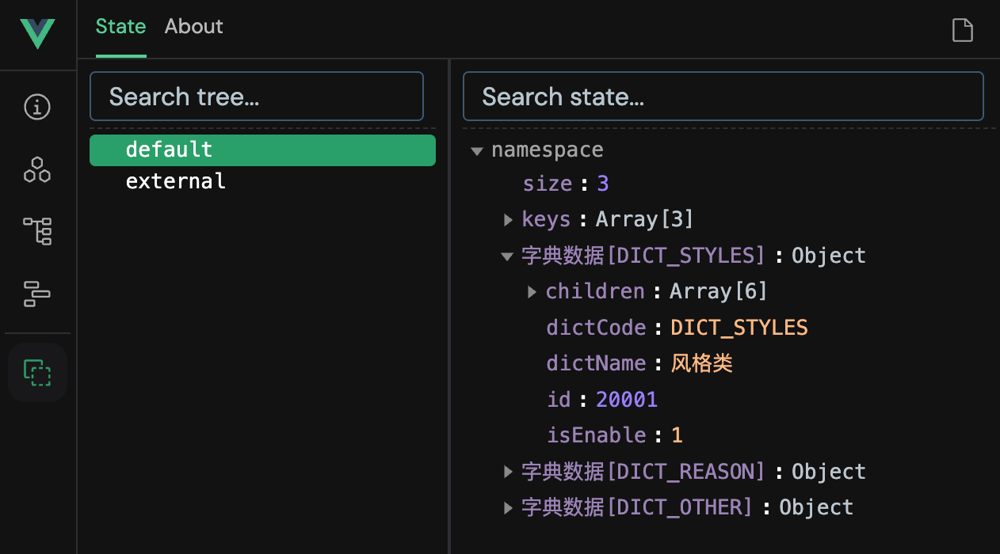

# Hooks 介绍

`@nullfu/dict-vue`是使用`@nullfu/dict-core`中`createDictManager`封装的 Vue Hooks, 并且提供完整的字典数据管理功能以及相应的工具函数。

考虑可能会存在不同来源的字典数据源, 故支持不同命名空间有自己的字段配置, 例如:

```ts
import { setupDictPlugin } from '@nullfu/dict-vue';

app.use(
  setupDictPlugin({
    default: {
      baseURL: 'http://localhost:5173',
      url: '/api/dict',
    },
    external: {
      baseURL: 'http://localhost:5173',
      url: '/api/external-dict'
    },
  })
);
```

## 调试工具

在 Vue.js devtools 中提供了查看字典数据的功能, 只需要在注册插件时传入第二个参数为`true`, 建议根据不同的环境动态配置, 从而更好的支持tree-shaking。

```ts
const IS_DEV = import.meta.env?.DEV;

app.use(
  setupDictPlugin({}, IS_DEV)
);
```

开启后, 在 Vue.js devtools 的调试工具的效果图如下:




::: tip
只是想尝试一下？跳到[快速开始](./getting-started)。
:::
